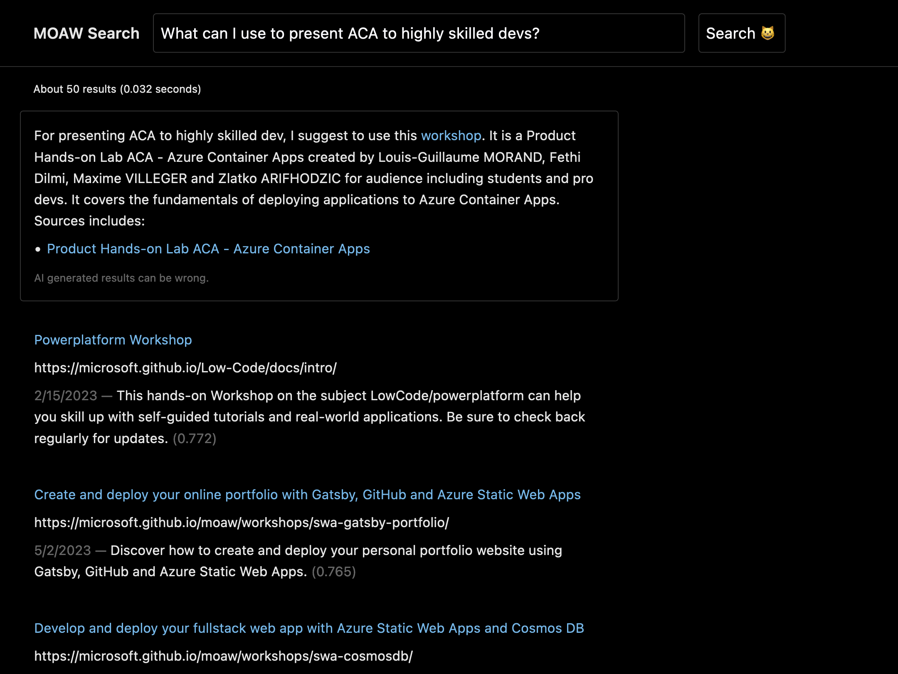
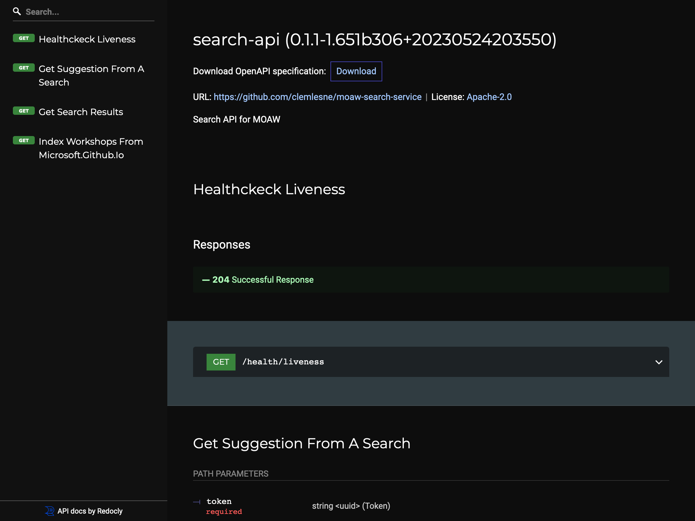
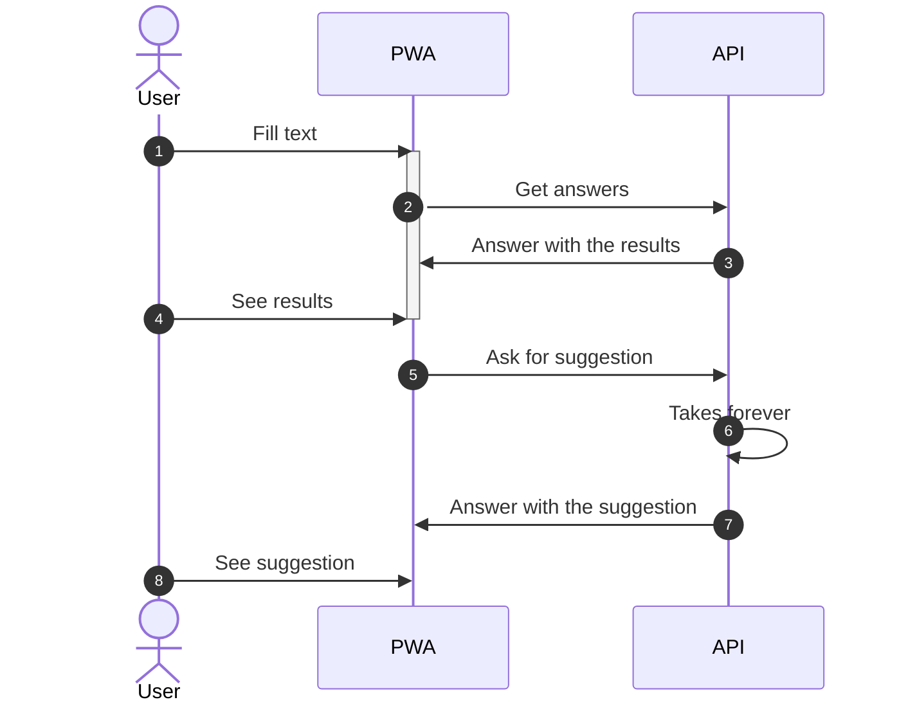
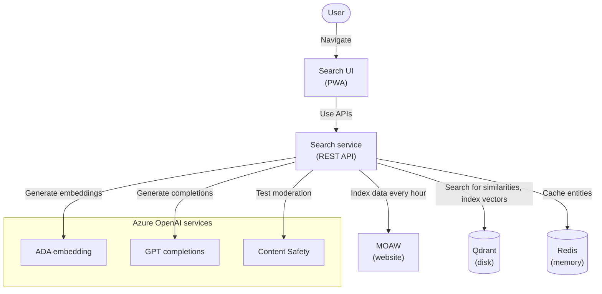
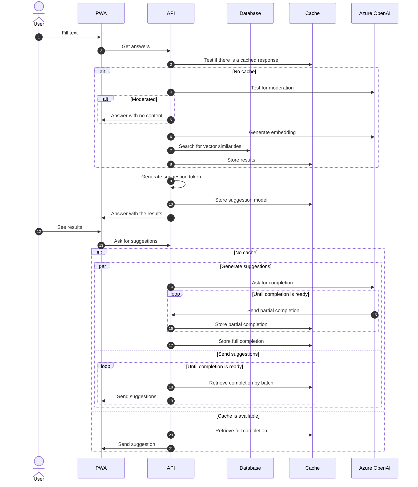

# MOAW Search

> 👋🏻 Demo available at [ms-clesne-2-26w0ryrv46wo.westeurope.cloudapp.azure.com](https://ms-clesne-2-26w0ryrv46wo.westeurope.cloudapp.azure.com).

MOAW Search is a search engine for the [MOAW](https://microsoft.github.io/moaw/) workshops. It use [Embeddings](https://platform.openai.com/docs/guides/embeddings) to find the most similar sentences to the query. Either hosted on [Azure Cognitive Services](https://learn.microsoft.com/en-us/azure/cognitive-services/what-are-cognitive-services) or [Azure Kubernetes Services (AKS)](https://learn.microsoft.com/en-us/azure/aks/intro-kubernetes). Search queries can be asked in natural language. It uses [Qdrant to index the data](https://github.com/qdrant/qdrant) and [Redis to cache the results](https://github.com/redis/redis). Suggestions are streamed from remote to the client in real time [using server-sent events](https://developer.mozilla.org/en-US/docs/Web/API/Server-sent_events/Using_server-sent_events).

OpenAI models used are:

- [`gpt-3.5-turbo`](https://platform.openai.com/docs/models/gpt-3-5) for the suggestions (`text-davinci-003` costs 10x more and this is sufficient for our use case)
- [`text-embedding-ada-002`](https://openai.com/blog/new-and-improved-embedding-model) for the search and data indexation
- [`text-moderation-stable`](https://platform.openai.com/docs/models/moderation) for the moderation



## How to use

### Run locally

Create a local configuration file, a file named `.env` at the root of the project:

```bash
# Misc
MS_LOGGING_APP_LEVEL=DEBUG

# Redis
MS_REDIS_DB=0

# Azure Cognitive Services
MS_ACS_API_BASE=https://[resource_name].cognitiveservices.azure.com
MS_ACS_API_TOKEN=[service_token]
MS_OAI_ADA_DEPLOY_ID=[deployment_name]
MS_OAI_GPT_DEPLOY_ID=[deployment_name]
OPENAI_API_BASE=https://[resource_name].openai.azure.com

# Azure SDK
# Here, example with a a service principal with a client secret
# See: https://learn.microsoft.com/en-us/python/api/azure-identity/azure.identity.environmentcredential?view=azure-python
AZURE_AUTHORITY_HOST=https://login.microsoftonline.com
AZURE_CLIENT_ID=[client_id]
AZURE_CLIENT_SECRET=[client_secret]
AZURE_TENANT_ID=[tenant_id]
```

This will build locally the containers, start them, and display the logs:

```bash
make build start logs
```

Then, go to [http://127.0.0.1:8081](http://127.0.0.1:8081).

### Deploy locally

All deployments are container based. You can deploy locally with Docker Compose or in Kubernetes with Helm.

```yaml
# values.yaml
serviceAccountName: moaw-search-sa
ingress:
  host: app.contoso.com
api:
  acs:
    base: https://[deployment].cognitiveservices.azure.com
    token: xxx-xxx-xxx
  oai:
    ada_deploy_id: text-embedding-ada-002
    base: https://[deployment].openai.azure.com
    gpt_deploy_id: gpt-35-turbo
```

```bash
# In Kubernetes, with Helm
NAMESPACE=moaw-search make deploy

# Locally, with Docker Compose
make build start logs
```

### Deploy in production

Deployment is container based. Use Helm to install the latest released chart:

```bash
helm repo add clemlesne-moaw-search https://clemlesne.github.io/moaw-search
helm repo update
helm upgrade --install default clemlesne-moaw-search/moaw-search
```

### Get API docs

Go to [http://127.0.0.1:8081/redoc](http://127.0.0.1:8081/redoc).



## How it works

### High level



### Architecture



## Advanced topics

### Sequence diagram



## [Authors](./AUTHORS.md)
