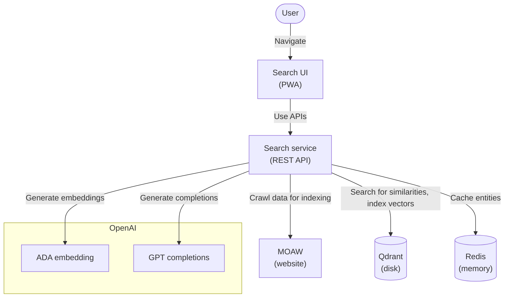

# MOAW Search

**Demo available at [moaw-search.shopping-cart-devops-demo.lesne.pro](https://moaw-search.shopping-cart-devops-demo.lesne.pro/).**

MOAW Search is a search engine for the [MOAW](https://microsoft.github.io/moaw/) workshops. It use [OpenAI Embedding](https://platform.openai.com/docs/guides/embeddings) to find the most similar sentences to the query. Search queries can be asked in natural language.

OpenAI models used are:

- [`text-embedding-ada-002`](https://openai.com/blog/new-and-improved-embedding-model) for the search and data indexation
- [`gpt-3.5-turbo`](https://platform.openai.com/docs/models/gpt-3-5) for the suggestions (`text-davinci-003` costs 10x more and this is sufficient for our use case)


## How it works



## How to use

### Run locally

This will build locally the container, start them, and display the logs:

```bash
make build start logs
```

Then, go to [http://127.0.0.1:8081](http://127.0.0.1:8081).

### Deploy in production

Use Helm to install the latest released chart:

```bash
helm repo add clemlesne-moaw-search https://clemlesne.github.io/moaw-search
helm repo update
helm upgrade --install default clemlesne-moaw-search/moaw-search
```

### Get API docs

Go to [http://127.0.0.1:8081/redoc](http://127.0.0.1:8081/redoc).


## [Authors](./AUTHORS.md)
